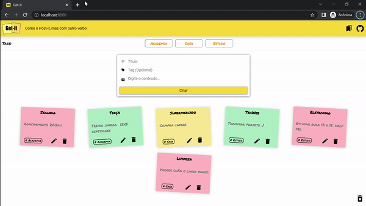

# Get-it : Como o Post-it, mas com outro verbo


## Descrição do Projeto

<p align="justify">

Get-it de criação e edição  de notas. Projeto realizado em Django utiliazando o banco de dados PostgreSQL (em um container Docker) .
Pastas e arquivos de interesse:

- `notes/static` : arquivos estáticos. Arquivos CSS, javascript ou imagens.
  
- `notes/templates` : arquios html da página.
  
- `notes/views.py` : arquivos com funções de renderização ou direcionamento. 
  
- `notes/models.py` : modelos utilizado pelo banco de dados.
  
- `notes/urls.py` : define rotas do aplicativo.

- `requirements.txt` : arquivos com bibliotecas utilizadas.
  
</p>

## Features realizadas

1. CRUD implementar com funcionalidades de criação, listagem, edição e remoção de anotações aplicando o mesmo estilo (css).

2. Banco de dados PostgreSQL.

3. Sistema de Tags implementadas.

4. Projeto disponibilizado pelo Heroku.


## Funcionalidades extras adicionadas

- **Drag and down de notas** : é possível arrastar as notas segurando o botão esquerdo do mouse e arrastando. 

- **Botão delete all** : icone de lixeira no canto direito da tela que possibilita que todas as notas sejam apagadas do banco de dados.

- **Não repetição de tags**: implementação de uma lógica que impede a repetição de tags. Exemplo: Duas notas com a tag academia aparece apenas uma vez.

- **Sem notas , sem tags**: quando uma tag não esta atrelada a nenhuma nota a mesma é deletada do banco de dados.

- **Preenchimento obrigatório**: para a criação de uma nota é obrigatório a digitaçao de um título e um conteúdo, sendo disparado um alarme caso essa condição nao se cumpra. 

- **Animações** : toda a aplicação está repleta de animações! Investigue e se divirta :) 


## Instruções de uso 

**Rodando Localmente - Windows**

1. Realizar o clone do repositório.

2. Instalando dependências:


```bash

pip install -r requirements.txt

```

3. Para rodagem do arquivo local, verificar se a variável DEBUG em `getit/settings.py` está com valor True.

4. Criar um container Docker com imagem Postgres. <p> <a href = "https://docs.docker.com/get-docker/"> Baixe o Docker</a> </p>

5. Ative o container no PowerShell ou em um terminal com permissão de administrador. 


```bash

docker run --rm --name pg-docker -e POSTGRES_PASSWORD=[escolhaumasenha] -d -p 5432:5432 -v $HOME/docker/volumes/postgres:/var/lib/postgresql/data postgres

```

6. Por fim, na pasta do projeto clonado rode no terminal o comando abaixo e acesse em um navegador: `http://localhost:8000`

```bash

python manage.py runserver

```

**Acessando projeto via web (Aplicação Heroku)**

1. Apenas clique <a href = "https://immense-inlet-72722.herokuapp.com/">aqui</a>.

<p align="center"></p>


@2022, Insper. Quarto Semestre, Engenharia da Computação.
